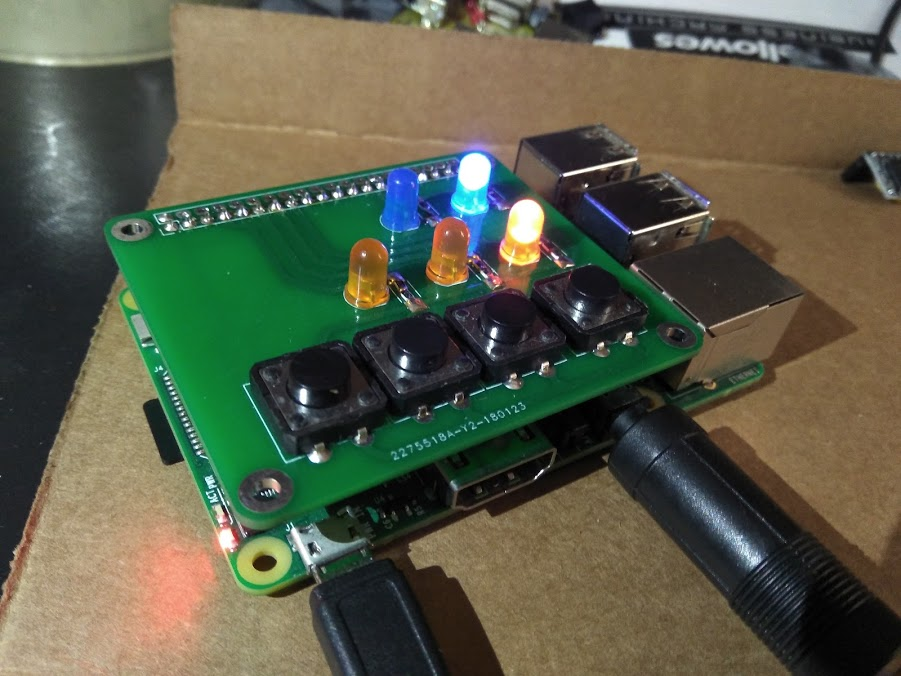

## Embedded School Bell System

This project is a school bell system implemented using Python on a Raspberry Pi 3 board. In addition to software control, a PCB shield was designed for easier control by school staff.

